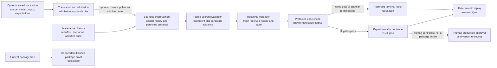

# Visual architecture and component map

This is a navigation map for the public, local package. It is not an
automatically complete call graph, and it does not replace the ordered
[operator guide](operate-rule-lab.md) as the authority for execution and
recovery.

The package records a local experimental result only. Neither an accepted
experiment nor a replay is a production approval; human promotion and vendor
encoding are outside this repository.

## Follow the flow

| Stage | Inputs | Public entry point and implementation | Outputs |
| --- | --- | --- | --- |
| Materialized history | A case directory: `manifest.json`, `scenarios.jsonl`, and an admitted `suite/` | [`scripts/run.ts`](../scripts/run.ts) → [`src/seams/run.ts`](../src/seams/run.ts) | A deterministic ledger directory, including `manifest.jsonl`, `metrics.jsonl`, and `verdicts.jsonl` |
| Saved translation and admission | A saved source export, saved model output, and expectations | [`scripts/translate.ts`](../scripts/translate.ts) → [`src/seams/parser.ts`](../src/seams/parser.ts) | `admission.json`; when admitted, `suite/catalog.yaml` and `suite/rules/translation.yaml` |
| Permitted change | An admitted suite, catalog authority, and a proposal | [`src/seams/proposal.ts`](../src/seams/proposal.ts) | An admitted or rejected proposal; admission is not experimental acceptance |
| Search evaluation | Search history, protected corpus, limits, and validation store | [`scripts/improve.ts`](../scripts/improve.ts) → [`src/bounded-improvement.ts`](../src/bounded-improvement.ts) | Experiment directory and `result.json`, including attempts and gate states |
| Paired comparison | Pinned inputs plus incumbent and candidate runs | [`scripts/compare.ts`](../scripts/compare.ts) → [`src/seams/comparison.ts`](../src/seams/comparison.ts) | `comparison-plan.json`, `comparison.jsonl`, and paired run evidence |
| Reserved and protected checks | Fresh reserved history/store; protected corpus | [`src/reserved-validation.ts`](../src/reserved-validation.ts), [`src/seams/protected-corpus.ts`](../src/seams/protected-corpus.ts) | Validation state and protected-case dispositions included in evidence |
| Replay | A saved experiment result | [`scripts/improve.ts`](../scripts/improve.ts) (`--replay`) → [`src/bounded-improvement.ts`](../src/bounded-improvement.ts) | A replayed `result.json`; the guide describes this as deterministic evidence, not a second experiment |
| Independent package proof | The current package tree | [`scripts/verify-finished-package.ts`](../scripts/verify-finished-package.ts) | `receipt.json` proving the bounded public-package workflow; it is not a consumer of a prior replay |

## Component navigation

The groups below are intentionally compact: they identify the public surfaces
and focused tests, rather than claiming every internal call edge.

| Group | Navigation | Inputs and outputs | Focused tests |
| --- | --- | --- | --- |
| Public CLIs | [`translate`](../scripts/translate.ts), [`run`](../scripts/run.ts), [`compare`](../scripts/compare.ts), [`validate`](../scripts/validate.ts), [`improve`](../scripts/improve.ts), [`improve example`](../scripts/improve-example.ts), [`step`](../scripts/step.ts), [`finished-package proof`](../scripts/verify-finished-package.ts) | Saved translation; case directories; proposals; validation stores; experiments; ledger output and proof receipts | [`assisted-parser`](../test/assisted-parser.test.ts), [`comparison`](../test/comparison.test.ts), [`reserved-validation`](../test/reserved-validation.test.ts), [`bounded-improvement`](../test/bounded-improvement.test.ts), [`historical-stepper`](../test/historical-stepper.test.ts) |
| Core evaluation | [`run seam`](../src/seams/run.ts), [`rules`](../src/rules.ts), [`scenario outcomes`](../src/scenario-outcomes.ts), [`daily totals`](../src/daily-totals.ts), [`merchant reference`](../src/merchant-reference.ts) | Case/suite inputs become canonical ledger and scenario evidence | [`scenario-outcomes`](../test/scenario-outcomes.test.ts), [`historical-stepper`](../test/historical-stepper.test.ts) |
| Improvement gates | [`bounded improvement`](../src/bounded-improvement.ts), [`comparison seam`](../src/seams/comparison.ts), [`proposal seam`](../src/seams/proposal.ts), [`protected corpus`](../src/seams/protected-corpus.ts) | Pinned histories, permitted proposals, reserved validation, and protected cases become experimental acceptance or no-improvement evidence | [`bounded-improvement`](../test/bounded-improvement.test.ts), [`comparison`](../test/comparison.test.ts), [`permitted-proposal`](../test/permitted-proposal.test.ts), [`reserved-validation`](../test/reserved-validation.test.ts) |
| Fixture groups | [`saved translation`](../fixtures/parser/assisted-readable/), [`readable improvement`](../fixtures/improvement/readable-history/), [`configured improvement`](../fixtures/improvement/configured-history/), [`comparison`](../fixtures/comparison/), [`run cases`](../fixtures/run/) | Invented materialized histories and expected evidence; not operator or tenant inputs | The focused tests linked above consume the relevant synthetic fixtures |
| Operating documentation | [operator guide](operate-rule-lab.md), [reusable task](operator-tasks/run-rule-lab.md), [bounded-improvement notes](bounded-improvement.md), [comparison notes](paired-comparison.md) | Ordered commands, expected evidence, and stop/recovery conditions | The guide's Node 24 command list and finished-package proof provide package-level verification |

## Read in execution order

Begin with the [README](../README.md), then use the
[operator guide](operate-rule-lab.md) for command order. The guide specifies
the required Node 24 check, new output locations, result paths, recovery
conditions, and the boundary between a local experiment and human-controlled
production action.
